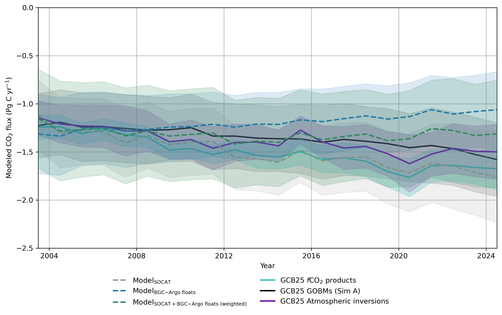

## The Southern Ocean CO2 sink in an evolving observing system

#### **L. Delaigue1\, P. Landschützer2, C. Wimart-Rousseau3, L. A., Arbilla4, 5, 6, J-B, Sallée4, S. Bushinsky7,  H. Claustre1, and R. Sauzède8**

<strong>Author Affiliations</strong>

  
1Sorbonne Université, CNRS, Laboratoire d'Océanographie de Villefranche, LOV, 06230 Villefranche-sur-Mer, France
  
2Flanders Marine Institute (VLIZ), Jacobsenstraat 1, 8400 Ostend, Belgium

3National Oceanography Centre Southampton, European Way, Southampton, SO14 3ZH, UK

4LOCEAN, Sorbonne Université, CNRS, IRD, MNHN, Laboratoire d'Océanographie et du Climat: Expérimentations et Approches Numériques, LOCEAN/IPSL, 75005 Paris, France

5Instituto Argentino de Oceanografía (IADO, CONICET-UNS), Bahía Blanca, Argentina

6Departamento de Geografía y Turismo, Universidad Nacional del Sur (UNS), Bahía Blanca, Argentina

7Department of Oceanography, SOEST, University of Hawai'i at Manoa, Honolulu, HI, USA

8Sorbonne Université, CNRS, Institut de la Mer de Villefranche, Villefranche-Sur-Mer, France 

*Corresponding author: Louise Delaigue ([louise.delaigue@imev-mer.fr](mailto:louise.delaigue@imev-mer.fr))*

> [!IMPORTANT]  
> This study is currently in review for *Global Biogeochemical Cycles*:
>

### Abstract
The Southern Ocean is a major sink for atmospheric CO2, yet its magnitude and trend remain uncertain due to spatially sparse and seasonally biased ship-based observations. Reconstructions based on the Surface Ocean CO2 Atlas (SOCAT) indicate a strengthening of this sink since the early 2000s, but such signals may reflect evolving observational coverage rather than basin-scale change. Here, we combine **SOCATv2025** with surface ocean partial pressure of CO2 (*p*CO2) estimates derived from BioGeoChemical (BGC-) Argo floats to assess how expanded autonomous sampling alters estimates of Southern Ocean air–sea CO2 exchange. Using feedforward multilayer perceptron (MLP) models trained on (i) SOCATv2025-only, (ii) BGC-Argo-only, and (iii) merged, uncertainty-weighted SOCATv2025–BGC-Argo data, we compute monthly air–sea CO2 fluxes south of 30°S for 2003–2024. Ship-only observations imply a strong intensification of the CO2 sink, but this signal weakens or disappears once floats are included, yielding a combined reconstruction with a near-zero long-term trend that is not statistically significant. The uncertainty-weighted combined reconstruction yields a mean Southern Ocean CO2 uptake of −1.33 ± 0.10 Pg C yr−1 over this period and is consistent with atmospheric inversion and global ocean biogeochemical model estimates from the Global Carbon Budget. Correcting for sampling biases reduces the inferred basin-scale sink by ~0.17 Pg C yr−1 (≈11%), consistent with observing system simulation experiments, while limiting systematic biases in float-derived *p*CO2 by anchoring autonomous observations to ship-based measurements. Integrating complementary observation streams provides a physically interpretable benchmark for Southern Ocean CO2 uptake and illustrates how explicit treatment of sampling biases can reconcile ship- and float-derived constraints.

### Analysis
This repository contains the raw data and scripts used to generate the results presented in the manuscript.

### License
This project is licensed under the GNU General Public License v3.0 – see the LICENSE file for details.

