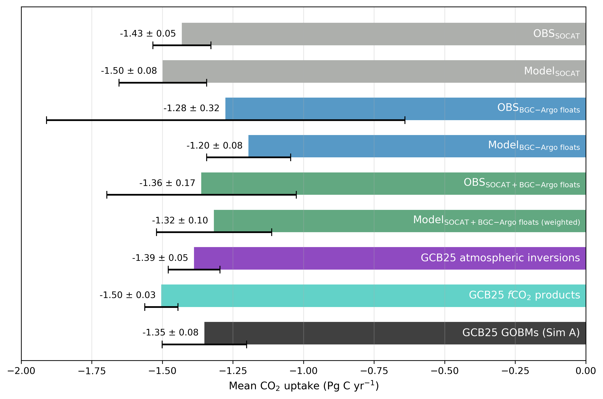

## The Southern Ocean CO2 sink in an evolving observing system

#### **L. Delaigue1\, P. Landschützer2, C. Wimart-Rousseau3, L. A., Arbilla4, 5, 6, J-B, Sallée4, S. Bushinsky7,  H. Claustre1, and R. Sauzède8**

<strong>Author Affiliations</strong>

  
1Sorbonne Université, CNRS, Laboratoire d'Océanographie de Villefranche, LOV, 06230 Villefranche-sur-Mer, France
  
2Flanders Marine Institute (VLIZ), Jacobsenstraat 1, 8400 Ostend, Belgium

3National Oceanography Centre Southampton, European Way, Southampton, SO14 3ZH, UK

4LOCEAN, Sorbonne Université, CNRS, IRD, MNHN, Laboratoire d'Océanographie et du Climat: Expérimentations et Approches Numériques, LOCEAN/IPSL, 75005 Paris, France

5Instituto Argentino de Oceanografía (IADO, CONICET-UNS), Bahía Blanca, Argentina

6Departamento de Geografía y Turismo, Universidad Nacional del Sur (UNS), Bahía Blanca, Argentina

7Department of Oceanography, SOEST, University of Hawai'i at Manoa, Honolulu, HI, USA

8Sorbonne Université, CNRS, Institut de la Mer de Villefranche, Villefranche-Sur-Mer, France 

*Corresponding author: Louise Delaigue ([louise.delaigue@imev-mer.fr](mailto:louise.delaigue@imev-mer.fr))*

> [!IMPORTANT]  
> This study is currently in review for *Global Biogeochemical Cycles*:
>

### Abstract
Wind forcing plays a pivotal role in driving upper-ocean physical and biogeochemical processes, yet direct wind observations remain sparse in many regions of the global ocean. While passive acoustic techniques have been used to estimate wind speed from moored and mobile platforms, their application to profiling floats has been demonstrated only in limited cases and remains largely unexplored. Here, we report on the first deployment of a Biogeochemical-Argo (BGC-Argo) float equipped with a passive acoustic sensor, aimed at detecting wind-driven surface signals from depth. The float was deployed in the northwestern Mediterranean Sea near the DYFAMED meteorological buoy from February to April 2025, operating at parking depths of 500–1000 m. We demonstrate that wind speed can be successfully retrieved from subsurface ambient noise using established acoustic algorithms, with float-derived estimates showing good agreement with collocated surface observations from the DYFAMED buoy. To evaluate the potential for broader application, we simulate a remote deployment scenario by refitting the acoustic model of Nystuen et al. (2015) using ERA5 reanalysis as a proxy for surface wind. Refitting the model to ERA5 data demonstrates that the float–acoustic–wind relationship is generalizable in moderate conditions, but high-wind regimes remain systematically biased—especially above 10 m s-1. Finally, we apply a residual learning framework to correct these estimates using a limited subset of DYFAMED wind data, simulating conditions where only brief surface observations—such as those from a ship during float deployment—are available. The corrected wind time series achieved a 37% reduction in RMSE and improved the coefficient of determination (R2) from 0.85 to 0.91, demonstrating the effectiveness of combining reanalysis with sparse in situ fitting. This framework enables the retrieval of fine-scale wind variability not captured by reanalysis alone, supporting a scalable strategy for float-based wind monitoring in data-sparse ocean regions—with important implications for quantifying air–sea exchanges, improving biogeochemical flux estimates, and advancing global climate observations.

### Analysis
This repository contains the raw data and scripts used to generate the results presented in the manuscript. The Jupyter Notebook includes the main processing, analysis, visualizations and statistical outputs. The MATLAB code used for the depth-dependent acoustic correction is based on the method from Cauchy et al. (2018), kindly provided by the lead author and modified to suit the needs of this study.

### License
This project is licensed under the GNU General Public License v3.0 – see the LICENSE file for details.

